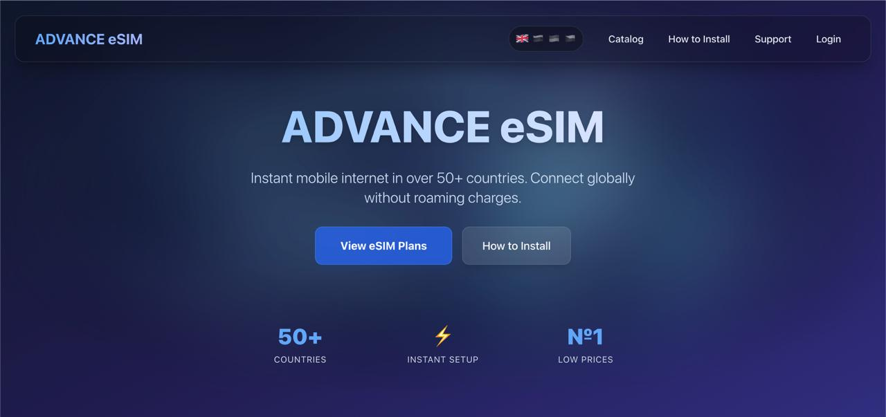
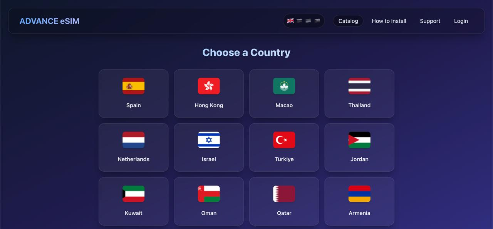
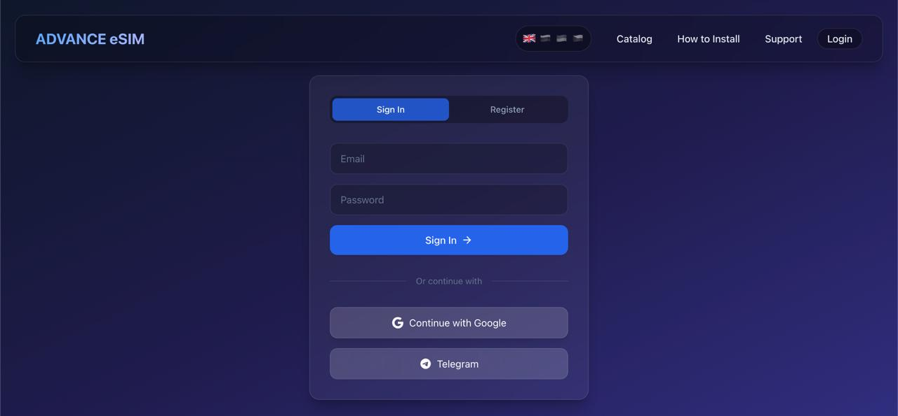
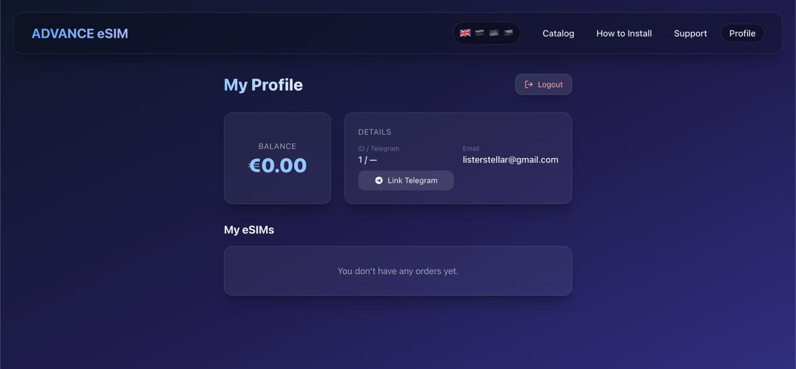
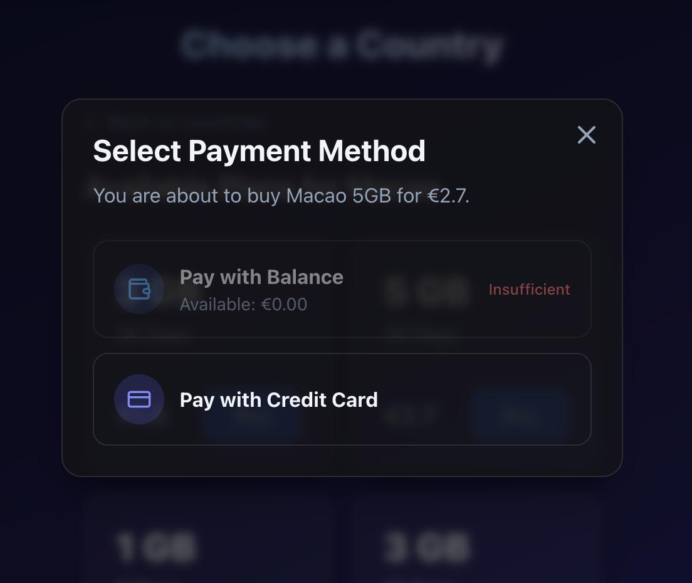
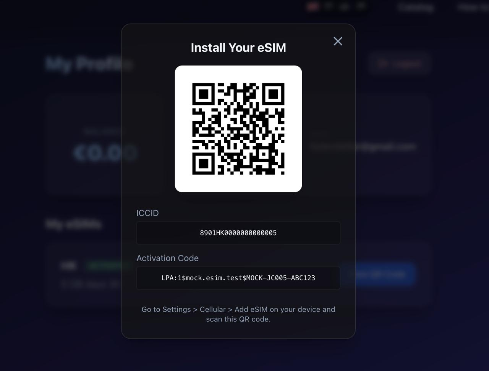

# ADVANCE eSIM 🌍


A complete platform for selling eSIMs, accessible via both a Web Application and a Telegram Bot. The platform supports Stripe payments, multi-language Telegram interface, internal balance, and instant eSIM QR code delivery.

## 📸 Screenshots

<details>
<summary><b>Click to expand screenshots</b></summary>
<br>

<div align="center">
  
  
  
  <br>
  
  
  
</div>

</details>

## 🌟 Features

- **Full-Stack Ecosystem**: Unified backend serving both the React frontend and the Telegram Bot.
- **Web App**: Responsive and beautifully designed frontend using React, TailwindCSS, and Zustand.
- **Telegram Bot**: Fully integrated bot for browsing the catalog, buying eSIMs, and managing profiles.
- **Payments**: Supports direct card payments via Stripe and internal account balance.
- **Instant Delivery**: Generates and delivers eSIM QR codes instantly via the UI or chat.
- **Localization**: Built-in translation mappings for global ISO-3 to ISO-2 countries.
- **OAuth Integration**: Apple, Google, and native Telegram Login widget on the web app.
- **Dockerized**: Containerized microservices architecture with `docker-compose`.

## 🛠 Tech Stack

### Frontend (`/frontend`)
- **Framework**: React 19 + Vite
- **Styling**: TailwindCSS 3 + Glassmorphism aesthetic
- **State Management**: Zustand
- **Validation**: Zod
- **Networking**: Axios

### Backend (`/backend`)
- **Framework**: FastAPI (Python 3.11)
- **Database**: PostgreSQL 15 + SQLAlchemy 2.0 (asyncpg)
- **Authentication**: JWT (PyJWT), bcrypt
- **Payments**: Stripe SDK
- **Image Generation**: qrcode + Pillow (for QR generation)

### Telegram Bot (`/bot`)
- **Framework**: aiogram 3.x
- **Networking**: aiohttp / httpx
- **Features**: Async handlers, Webhooks/Polling, multi-language catalog.

### Infrastructure (`/nginx`, `docker-compose.yml`)
- **Reverse Proxy**: NGINX (serving compiled Vite static files and proxying API)
- **Orchestration**: Docker Compose
- **Tunneling**: Ngrok (for testing Telegram webhooks locally)

## 📁 Project Structure

```
esim-app/
├── backend/            # FastAPI backend, auth, database models, Stripe, eSIM services
├── bot/                # Telegram bot (aiogram), UI keyboards, handlers
├── frontend/           # React Web Application
├── nginx/              # Nginx configurations for routing
├── docker-compose.yml  # Orchestrates DB, Backend, Bot, Nginx, Ngrok
├── .env.example        # Environment variables template
└── README.md           # This file
```

## 🚀 Quick Start

### 1. Prerequisites
- [Docker](https://www.docker.com/) and Docker Compose
- [Node.js](https://nodejs.org/) (for local frontend development)
- [Python 3.11+](https://www.python.org/) (for local backend/bot development)
- Ngrok account (for local Telegram bot testing)

### 2. Environment Setup

Copy the example environment file:
```bash
cp .env.example .env
```

Open `.env` and fill in the critical variables:
- `POSTGRES_USER`, `POSTGRES_PASSWORD`, `POSTGRES_DB` (Database credentials)
- `JWT_SECRET` (For Web App authentication)
- `BOT_TOKEN` (From [@BotFather](https://t.me/BotFather))
- `VITE_TELEGRAM_BOT_NAME` (For the Telegram Login widget on the frontend)
- `STRIPE_SECRET_KEY` (For payments)
- `NGROK_AUTHTOKEN` & `NGROK_DOMAIN` (For local testing)

### 3. Running with Docker Compose

To start the entire stack (Database, Backend, Bot, Frontend/Nginx, Ngrok):

```bash
docker-compose up -d --build
```

- **Frontend Web App**: `https://<your-ngrok-domain>` (MUST be accessed via Ngrok; otherwise, the Telegram Login Widget will throw a `Bot domain invalid` error and webhooks won't work!)
- **Backend API Docs**: `https://<your-ngrok-domain>/api/docs`
- **Telegram Bot**: Automatically sets a webhook on your Ngrok domain to receive updates.

> [!IMPORTANT]
> **Telegram Login Widget Configuration**: You MUST configure your Ngrok domain with Telegram to allow the login widget to function.
> Send the `/setdomain` command to [@BotFather](https://t.me/BotFather), select your bot, and enter your Ngrok domain (e.g., `https://your-domain.ngrok-free.app`).

### 4. Local Development

**Frontend**:
```bash
cd frontend
npm install
npm run dev
```

**Backend**:
```bash
cd backend
python -m venv venv
source venv/bin/activate
pip install -r requirements.txt
uvicorn main:app --reload --port 8000
```

**Bot**:
```bash
cd bot
python -m venv venv
source venv/bin/activate
pip install -r requirements.txt
python bot.py
```

## 💳 Provider Integration

Currently, the system is configured to use a mock provider by default (`ESIM_PROVIDER=mock`). 
To connect a real provider, update your `.env`:

**eSIM Access (Redtea Mobile)**
```env
ESIM_PROVIDER=esimaccess
ESIMACCESS_ACCESS_CODE=your_access_code
ESIMACCESS_SECRET_KEY=your_secret_key
```

**Celitech**
```env
ESIM_PROVIDER=celitech
CELITECH_CLIENT_ID=your_client_id
CELITECH_CLIENT_SECRET=your_client_secret
```

**Airalo Partners**
```env
ESIM_PROVIDER=airalo
ESIM_API_KEY=your_key
ESIM_API_URL=https://sandbox-partners-api.airalo.com
```

**eSIM Go**
```env
ESIM_PROVIDER=esimgo
ESIM_API_KEY=your_key
ESIM_API_URL=https://api.esim-go.com
```
